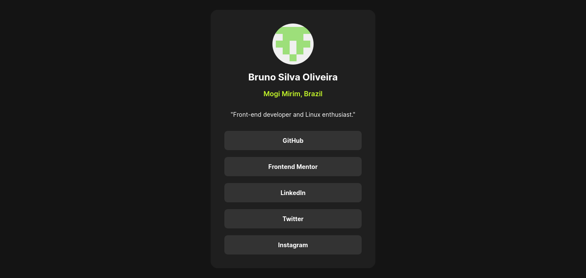

# Frontend Mentor - Social links profile solution

This is a solution to the [Social links profile challenge on Frontend Mentor](https://www.frontendmentor.io/challenges/social-links-profile-UG32l9m6dQ). Frontend Mentor challenges help you improve your coding skills by building realistic projects.

## Table of contents

- [Overview](#overview)
  - [The challenge](#the-challenge)
  - [Screenshot](#screenshot)
  - [Links](#links)
- [My process](#my-process)
  - [Built with](#built-with)
  - [What I learned](#what-i-learned)
- [Author](#author)

## Overview

### The challenge

Users should be able to:

- See hover and focus states for all interactive elements on the page

### Screenshot



### Links

- Solution URL: [Add solution URL here](https://your-solution-url.com)
- Live Site URL: [https://socials-profile.netlify.app/](https://socials-profile.netlify.app/)

## My process

### Built with

- Semantic HTML5 markup
- Flexbox
- [React](https://reactjs.org/) - JS library
- [Sass](https://sass-lang.com) - CSS Preprocessor

### What I learned

Learning a lot on how to structure my files in a better way. 

Still had issues with height and flexbox, which depending on the device, makes it so that the card top-part disappears.

Workaround:

```css
#root {
  height: 100vh;
  min-height: 40rem; /* fix? */
  display: flex;
  justify-content: center;
  align-items: center;

  * {
    min-width: 0;
  }
}
```

# Author

- Frontend Mentor - [@Bruno514](https://www.frontendmentor.io/profile/Bruno514)
